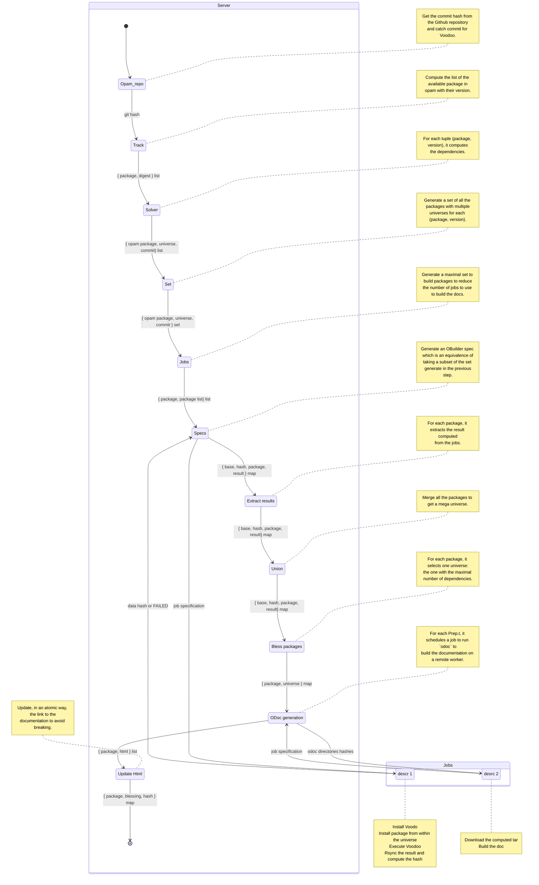
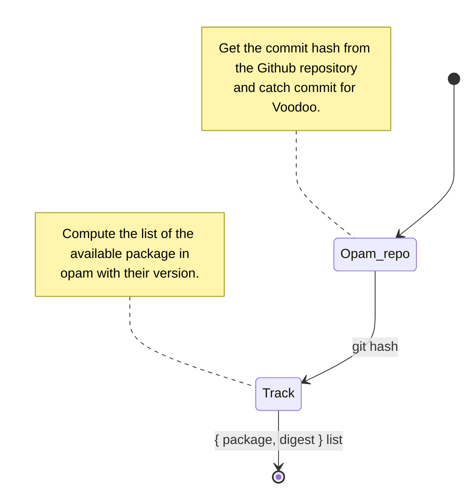
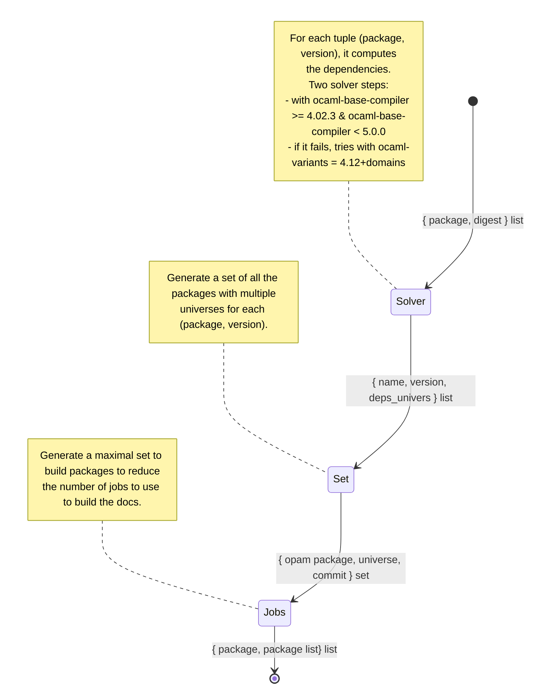
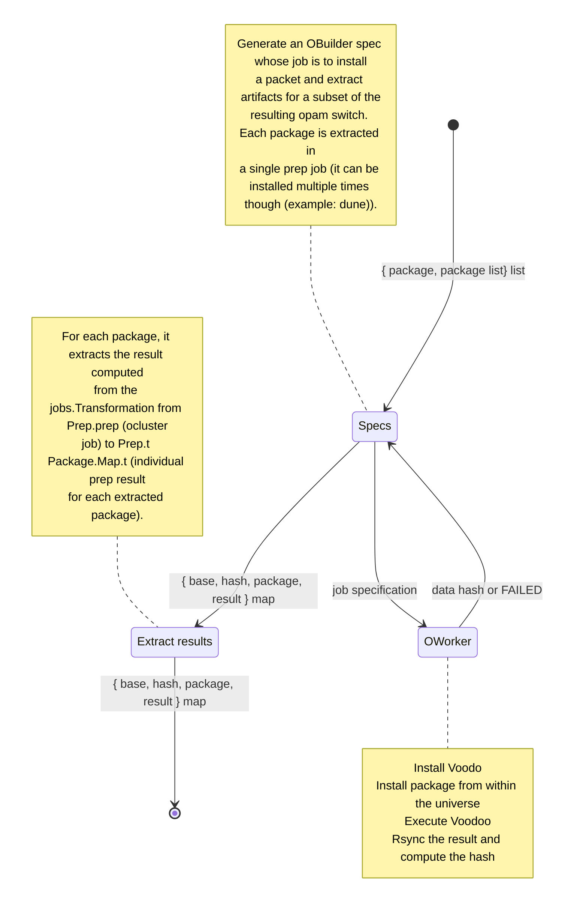
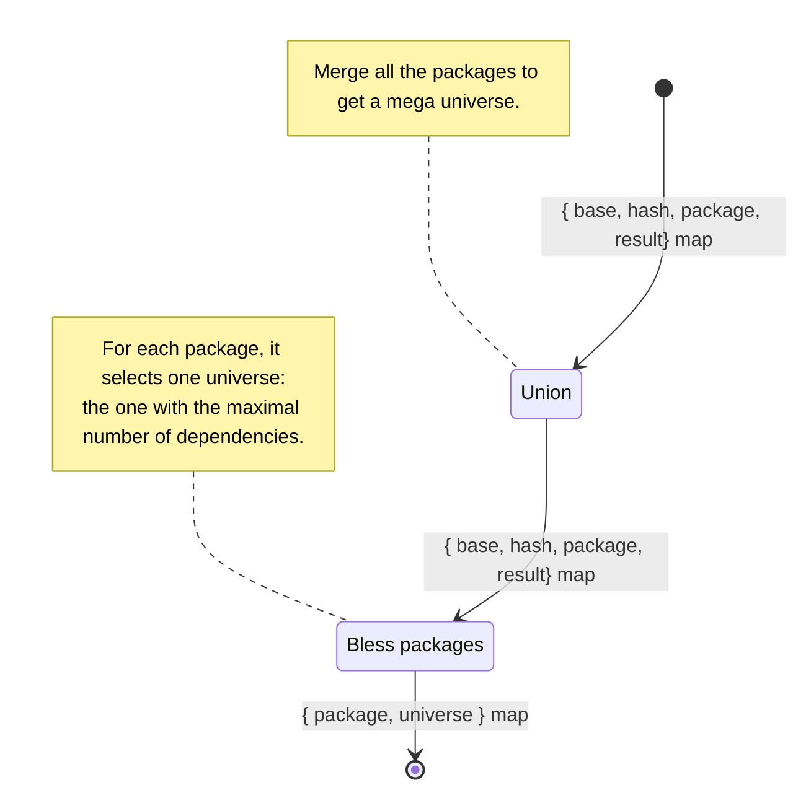
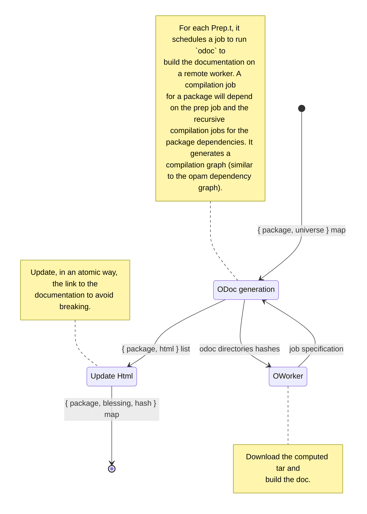

# OCaml-docs-ci

###### tags: `ocurrent` `tarides` `summary`

## Links:

- [ocaml-docs-ci GitHub](https://github.com/ocurrent/ocaml-docs-ci)
- [Voodoo Github](https://github.com/ocaml-doc/voodoo)

## Abstract

First, the purpose of this `ocurrent` pipeline is to compile the documentation of every package in the "opamverse". To do so, it generates what we call a dependency universe. For each package (alongside with the version), the documentation is related to the packages whom our package has been compiled with. For each package, we have to compute at least a dependency universe in the form of a hash of all the (package, version) used to build it.

Once we have computed our universes, we select the one with the largest number of dependencies and we use `odoc` to generate the `html` documentation and push it to [docs-data.ocaml.org](docs-data.ocaml.org). For example, for `irmin.2.7.2`, the documentation is stored [here](https://docs-data.ocaml.org/live/p/irmin/2.7.2/doc/Irmin/index.html). This `html` is then used by [ocaml.org](ocaml.org) to display the documentation to the user in the package explorer system.

The following schema are going through the build step in a more detailled way.

## Schema

### General schema

This is the global representation of the pipeline executed by `ocaml-docs-ci`. The next steps are a split version of it, as it's too big to be understandable at one.

### Track the packages from opam

### Compute the set of dependencies

#### Build the packages

### Select the packages and the universe

### Build the documentation and upload on docs-data.ocaml.org

